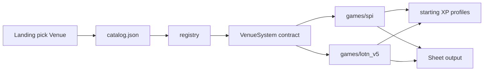

# SPI Venue Structure

Design bible for adding **Society of Paranormal Investigators** as a second Venue.
Sheet generator for oneshots and NPCs — not MES chronicle intake.

**Status:** structure locked for scaffolding prep. No `games/spi/` package yet.
**Sources:** MES SPI docs + official character sheet under `reference/spi/` (gitignored).

---

## 1. Product scope

### In

- Procedural **sheets**: Attributes, Skills, specialties, Affinity, Division, Faction, Archetype-driven spends, Merits (general + Affinity), Virtue/Vice, derived advantages, XP spend log.
- Flat CoD-style XP via **starting XP profiles**: MES datetime preset, fixed **35**, **custom**.

### Out

- Approvals workflow, VIP, CCD, Dark Places, MC-as-required path
- Touchstones, Aspirations (on generated sheets)
- Conditions / live character tracking
- Status as a picker (see §2.1)
- Full Affinity power prose (ids, costs, prereqs, tags for weighting only)
- VSS authoring, Ikons catalog, Research Tree, Sworn Knights, item crafting

---

## 2. Locked product decisions

| Topic | Decision |
|-------|----------|
| XP profiles | MES datetime preset, fixed **35**, **custom** |
| Wizard order | `xp_profile → division → faction → archetype → affinity? → generate` |
| Division | Explicit pick (except full random) |
| Faction | Division-like wizard step; **biases** spends |
| Archetypes | Yes; Affinity usually from archetype biases |
| Affinity | Optional pre-lock; otherwise downstream of archetype |
| Virtue / Vice | Include on sheet |
| Touchstones / Aspirations | Omit |
| Conditions | Ignore (no live tracking) |
| Status | No picker; always emit **Division Status 1** (see §2.1) |
| Prereqs | **Bundle** missing prereqs into purchase cost (see §2.2) |

### 2.1 Division Status

Rules allow starting at Division Status **1 or 2**. For oneshot/NPC sheets we always record **Status 1** (the default floor). STs can bump in play. Local Status omitted.

### 2.2 Prerequisite bundling

When a desired trait’s prereqs are unmet, the generator may still select it: candidate **cost** = XP for the trait **plus** XP to buy missing prereq dots (attributes, skills, merits, Affinity), recursively. Efficiency weighting scores the whole bundle against remaining budget.

**Parsing approach (prep):**

1. Prefer structured fields extracted from the sheet tables (dot ranges, Affinity type, category).
2. Parse clean prereq strings where regular (`Resolve 3`, `Fae Affinity 1`, `Brawl 2`).
3. Fighting-style / messy chains: soft-skip or human-tagged until parsers are solid — do not block scaffolding.

### 2.3 Wizard steps (detail)

```text
xp_profile → division → faction → archetype → [optional affinity lock] → generate
```

- Full random: may roll Division / Faction / Archetype.
- Affinity step only when the user unlocks / pre-defines Affinity; default path leaves Affinity to archetype bias + free Affinity dot rules.

---

## 3. Terminology

| Term | Meaning | Examples |
|------|---------|----------|
| **Venue** | Game line | LotN V5, SPI, Werewolf Apocalypse |
| **VSS** | Local Venue Style Sheet | Deferred |
| **Starting XP profile** | XP budget source | MES datetime, fixed 35, custom |

**Repo naming debt:** catalog/registry say `game`; `wod_chargen/venues/` holds XP profiles; wizard step `venue` means XP profile. Design/UI copy uses Venue correctly; code rename is a later pass.



---

## 4. Proposed Venue package tree

```
wod_chargen/games/spi/
  __init__.py
  paths.py
  system.py
  generator.py                  # later
  sheet_model.py                # later
  data/
    wizard_ui.json
    character_types.json        # investigator
    creation.json
    costs.json
    attributes.json             # CoD: Presence not Charisma
    skills.json                 # CoD: Weaponry not Melee
    affinity_types.json
    affinity_levels.json        # L1–5 benefit keys (labels)
    divisions.json
    factions.json               # with bias hooks
    archetypes/                 # bias packs (Affinity downstream)
    merits.json                 # general + affinity; ids/costs/prereqs/tags
    advantages.json
```

**XP profiles** (later): `venues/picker.json` → `"spi": ["mes_spi", "fixed_35", "custom_xp"]` (names TBD).  
**Catalog:** `"spi"` with `implemented: false` until a UI spike.

**Extract source:** `reference/spi/character_sheet.xlsx` tabs `merit-table` / `affinity-table` (catalog only; no prose).

---

## 5. Sheet shapes

### 5.1 Official SPI sheet (source of truth)

From MES `character_sheet.xlsx` printable layout:

- **Header:** Name, Concept, Virtue, Vice, Faction, Division  
- **Attributes** (columns Mental | Physical | Social):
  - Mental: Intelligence, Wits, Resolve  
  - Physical: Strength, Dexterity, Stamina  
  - Social: **Presence**, Manipulation, Composure  
- **Skills** (CoD 2e; Mental −3 / Phys+Soc −1 unskilled):
  - Mental: Academics, Computer, Crafts, Investigation, Medicine, Occult, Politics, Science  
  - Physical: Athletics, Brawl, Drive, Firearms, Larceny, Stealth, Survival, **Weaponry**  
  - Social: Animal Ken, Empathy, Expression, Intimidation, Persuasion, Socialize, Streetwise, Subterfuge  
- **Other traits:** General Merits, Affinity Merits, Affinities (5 tracks), Health, Willpower, Integrity  
- **Derived:** Speed, Initiative, Perception, Defense, Clash of Wills (+ Downtime Actions / Max Integrity on working tabs)

**Not on sheet / not in our generator:** classic Flaws track (CoD 2e uses Conditions instead — we ignore Conditions). Touchstones exist in SPI rules (HtV-derived) but we **omit** them on generated sheets.

### 5.2 Shared envelope

`GenerationResult` stays shared (`game_id` = Venue id; `venue_id` = XP profile id — naming debt).

### 5.3 `SpiSheetModel` (target)

```text
SpiSheetModel {
  header: SheetHeader       # Division, Faction, Archetype, Affinity summary, Virtue, Vice, concept?
  attributes: TraitPanel    # Mental / Physical / Social (Presence)
  skills: TraitPanel        # CoD skills (Weaponry)
  specialties: string[]
  affinities: RatedTraitsSection
  merits_general: RatedTraitsSection
  merits_affinity: RatedTraitsSection   # or by AffinityType
  advantages: MetaItem[]    # Health, Speed, Willpower, Initiative, Perception,
                            # Defense, Clash of Wills, Downtimes, Integrity, Max Integrity
}
```

### 5.4 Character dict sketch

```text
character {
  type: "investigator",
  concept?: string,
  virtue, vice,
  attributes: { intelligence, wits, resolve, strength, dexterity, stamina,
                presence, manipulation, composure },
  skills: { academics, computer, crafts, … weaponry, … },
  specialties: string[],
  affinities: { ghost, spirit, mage, fae, vampire },  # 0..5; sum ≥ 1
  division, faction,
  division_status: 1,          # always for generator output
  archetype, sub_archetype?,
  merits: { "<id>": dots },
  integrity, size: 5,
  advantages: { health, speed, willpower, initiative, perception,
                defense, clash_of_wills, downtimes, max_integrity }
}
```

Hard rules:

- Free Affinity 1 at creation; Affinity merit dots per type ≤ `3 × AffinityRating[type]`
- `max_integrity = 11 − sum(top two Affinities)`; start `min(7, max_integrity)`
- No Greater/Lesser templates
- Prereq bundling when buying gated traits

---

## 6. JSON field sketches

### 6.1 `affinity_types.json`

Five types: `ghost`, `spirit`, `mage`, `fae`, `vampire` — each with `fuel`, `place_merit`, `unseen_sense`, `sense_mode` (see Affinity Guide). Used for sheet labels and bias hooks, not Ikon simulation.

### 6.2 `affinity_levels.json`

L1–5 **keys** only (unlock powers, Unseen Sense, sense mode, fuel, place detect, bans, downtime penalty). Prose deferred.

### 6.3 `divisions.json` / `factions.json`

Division: five Society Divisions (Acquisitions, Adventure, Defense, Health and Welfare, R&D) + bias profile refs.  
Faction: SPI political factions + bias profile refs (seed from Division Guide / chronicle docs when scaffolding).

### 6.4 `creation.json`

```json
{
  "attributes": { "base_dots": 1, "primary": 5, "secondary": 4, "tertiary": 3 },
  "skills": { "primary": 11, "secondary": 7, "tertiary": 4 },
  "specialties": 3,
  "free_affinity_dots": 1,
  "merit_dots": 7,
  "max_affinity_merit_dots_at_creation": 3,
  "integrity_default": 7,
  "size_default": 5,
  "affinity_merit_dots_per_affinity_level": 3,
  "division_status_default": 1
}
```

### 6.5 `costs.json` (flat per dot)

Affinity 5 · Attribute 4 · Skill 2 · Integrity 2 · Supernatural Resistance 2 · Specialty 1 · Merit 1 · Willpower-dot regain 1.

### 6.6 `merits.json`

Extract from sheet `merit-table` + `affinity-table`:

```json
{
  "id": "psychometry",
  "label": "Psychometry",
  "category": "affinity",
  "affinity_type": "ghost",
  "dots_min": 3,
  "dots_max": 3,
  "prereq_text": "",
  "prereqs": [],
  "tags": ["affinity_power"]
}
```

- `category: general | affinity`  
- Affinity merits count against `3 × Affinity` pool  
- General merits with Affinity floors do **not** burn that pool  
- No Flaws catalog

### 6.7 `advantages.json`

Same formulas as SPI sheet / chargen guide (Health, Speed, Willpower, Initiative, Perception, Defense, Clash = max resistant attr + Occult, Downtimes = Resolve+1, Max Integrity).

### 6.8 `attributes.json` / `skills.json`

Explicit CoD lists (§5.1). Do **not** reuse LotN `charisma` / `melee`.

### 6.9 `wizard_ui.json`

```json
{
  "wizard_steps": ["xp_profile", "division", "faction", "archetype", "affinity", "generate"],
  "optional_steps": ["affinity"],
  "copy": {
    "landing_blurb": "Build a Society investigator sheet for oneshots or NPCs.",
    "division_title": "Division",
    "faction_title": "Faction",
    "archetype_title": "Archetype",
    "affinity_title": "Affinity (optional lock)",
    "xp_title": "Starting XP"
  }
}
```

---

## 7. VenueSystem contract

| Method / property | Role |
|-------------------|------|
| `id`, `label`, `tagline` | Venue identity |
| `get_wizard_steps()` / `get_wizard_copy()` | UI |
| Pickers | Division, Faction, Archetypes; optional Affinity lock |
| `get_xp_profile_picker()` | Today: `get_venue_picker()` |
| `generate(...)` → `GenerationResult` | Engine |
| `build_sheet_model(...)` | Sheet VM |

Landing: pick **Venue** first, then that Venue’s wizard.

---

## 8. Pre-build coupling checklist

| Area | Issue |
|------|--------|
| [`registry.py`](../wod_chargen/games/registry.py) | Only `LotnV5System` |
| [`app/wizard.py`](../app/wizard.py), sheet, views | LotN imports; clan/predator state |
| [`core/share.py`](../wod_chargen/core/share.py) | LotN option keys |
| [`core/xp_log_format.py`](../wod_chargen/core/xp_log_format.py) | LotN discipline labels |
| [`venues/picker.json`](../wod_chargen/venues/picker.json) | No `spi` XP profiles yet |
| Naming | `game` vs Venue; `venue` vs XP profile |

---

## 9. Defer list

Approvals, VIP, CCD, Touchstones/Aspirations UI, Conditions, Status politics, Ikons, Research Tree, power prose, Sworn Knights, item crafting, VSS, MC membership progression, mass `games`/`venues` rename.

---

## 10. Next phases

1. Extract catalogs from `character_sheet.xlsx` → seed JSON (ids, costs, prereq text, tags)  
2. Scaffold `games/spi/` + catalog stub (`implemented: false`) + XP profile stubs  
3. VenueSystem Protocol (LotN adapter) when wiring UI  
4. Generator MVP with archetype/Faction/Division bias + prereq bundling  
5. `SpiSheetModel` + wizard steps  

---

## 11. Success criteria

- [x] Sheet-only oneshot/NPC framing  
- [x] Venue vs XP profile terminology  
- [x] Official SPI/CoD sheet shape (Presence, Weaponry, no Flaws)  
- [x] Locked wizard order and product decisions  
- [x] Prereq bundling + parsing approach  
- [x] JSON sketches + coupling checklist  
